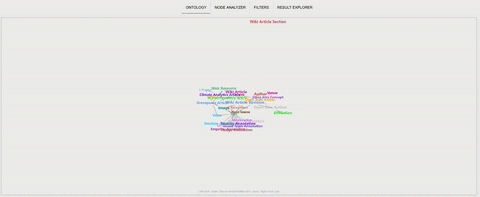
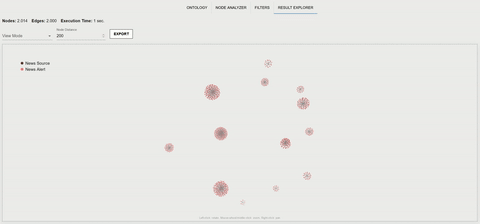
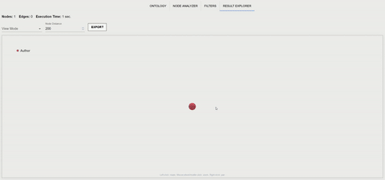

<h1 align="center">Welcome to GraphDetective </h1>
<p align="center">
  <a href="https://img.shields.io/badge/Made%20with-Python-1f425f.svg">
    
  </a>
    <a href="https://img.shields.io/badge/Made%20with-React-1f425f.svg">
    
  </a>
<a href="https://zenodo.org/doi/10.5281/zenodo.10285971"></a>
 <a href="https://github.com/DLR-SC/corpus-annotation-graph-builder/blob/master/LICENSE">
    
  </a>
    <a href="https://twitter.com/dlr_software">
    
  </a>
</p>


This repository provides the code for our Paper "Graph Detective - Comprehensive User Interface for Intuitive Graph Exploration and Analysis", submitted to [DocEng 2024](https://doceng.org/doceng2024).

> Graph databases are used across several domains due to the intuitive structure of graphs. Yet, querying such graphs requires database   experts’ involvement, reducing accessibility to non-experts. To address this issue, we present  GraphDetective, a web interface that  provides an intuitive entry point for graph data exploration, where users can create queries visually with little effort, eliminating  the need for expertise in query writing. After processing, the resulting query output (a graph) is then rendered in an interactive 3D visualization for an easy interpretation. Our user evaluation revealed that even individuals inexperienced with graph databases or graph data in general could  satisfactorily access the graph data through our interface. Furthermore, experienced participants commented that they found our interface to be more efficient to use compared to writing explicit queries in a graph database query language.

##### UI Interface
###### Ontology View

###### Query Graph Visualization

###### Defining a QGV


###### Applying node filters


###### Query Graph Result

###### Navigating a graph result


###### Display Modes


###### Individual Node Expansion


## Installation
The application is divided into **Frontend** and **Backend**. They communicate via HTTPS and need to be installed and run individually. Furthermore, a **ArangoDB database** must be available.

### Frontend
The frontend runs on React. To install all modules and run the app, execute the following commands from within the folder `./graph_detective/frontend/`:

> `npm install --legacy-peer-deps`
> `npm start`

from the same folder. Alternatively, a docker file is included to install and run the frontend using 

> `docker build -f Dockerfile.client -t graph_detective_frontend.`
> `docker run -d -p 3000:3000 graph_detective_frontend`

### Backend
##### Installation
The backend runs on Flask. To install all libraries and run the app, use *pip* to execute the following commands from within the folder `./graph_detective/backend/`:
> `pip install -r ./requirements.txt`

Feel free to use your own package manager. Alternatively, a docker file is included to install and run the backend using
> `docker build -f Dockerfile.api -t graph_detective_backend .`
> `docker run -d -p 16001:16001 graph_detective_backend`

## Basic Usage
### Connecting to a database
When first opening the aplication in a web browser, it is not connected to any database. GraphDetective requires a configuration file for an ArangoDB, which you as the user can provide straight through the interface. Here is what this `config.json` file should look like (adjust to match your own data and information):
```json
{
	"db_config": {
		"DB_HOST":"<url>",
		"DB_PORT":"<port>",
		"DB_NAME":"<name of the database>",
		"DB_USER":"<user name to login>",
		"DB_PASSWORD":"<password for the user name>",
		"DB_GRAPH":"<name of the graph within the database",
		"DB_LABEL_ATTRIBUTE":"<default label to display in the graph. If unsure, use '_id' or '_key'>"
	},
    "collection_map": {
		"WikipediaArticle":"Wikipedia Article",
		"person":"Person",
		"sOmE_ColLeCtInOn":"Give it any name you want"
		...
    },
    "edges": {
		"WikipediaArticle":["Person"],
		"person":["sOmE_ColLeCtInOn"],
		"sOmE_ColLeCtInOn":["Person", "sOmE_ColLeCtInOn"]
		...
    },
    "collection_views": {
		"WikipediaArticle":"Wiki_View",
		"person":"person_view",
		...
    }
}
```
Here is an explanation for the entries:
 - `db_config`: This is the main configuration for the database connection.
 - `collection_map`: This contains all collections, that are displayed in the user interface. It further defines the display name for each collection. Any collection name not defined here will be unavailable in the frontend.
 - `edges`: Provide all edges that you would like to display and use in the graph. Any edge that is not defined here will not be usable or displayed in the graph. The format is as follows: keys represent the source collections, values are lists of target collections. This means, that each collection (...that has an edge) should be present in as a key exactly once. You do not need to provide the name of the edge.


### Define a QGV
A *Query Graph Visualization* is a visual graph structure that you want to query from the database. To define it, add collections onto the respective canvas area on the top and connect them as desired. Then hit execute.


Depending on the query, execution can be instant or take a while. Once done, the resulting graph is displayed in the visualization area below. Interact with the graph through panning, zooming, dragging and clicking.


